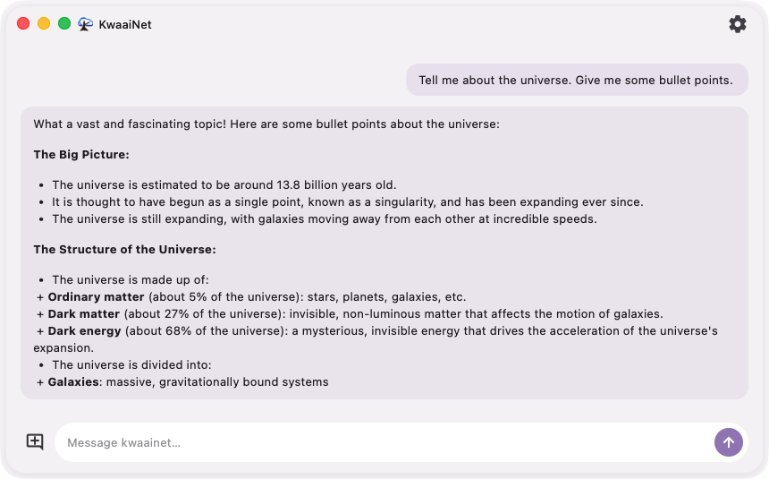
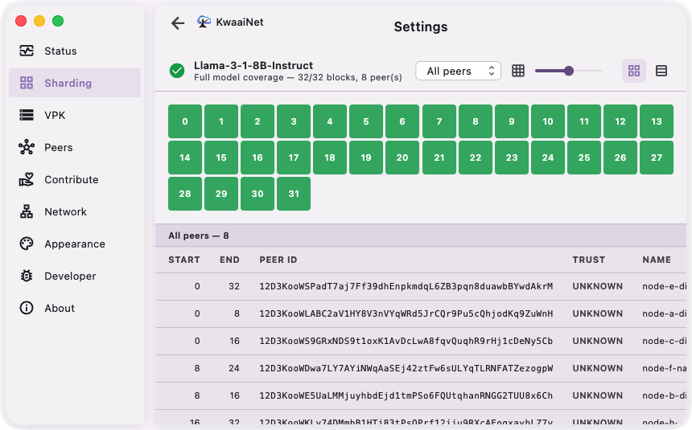
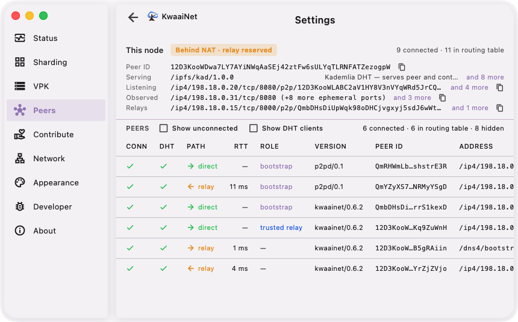

# KwaaiNet GUI

**Chat with AI that runs on a network of people's computers — then lend yours
to the mesh.**

<p align="center">
  <picture>
    <source media="(prefers-color-scheme: dark)" srcset="docs/screenshots/chat-darkmode.png">
    
  </picture>
</p>

KwaaiNet GUI is the desktop app for
[KwaaiNet](https://github.com/Kwaai-AI-Lab/KwaaiNet), a peer-to-peer network
that serves large language models from ordinary machines instead of a
datacenter. Each peer hosts a slice of the model; your prompt flows through
them and the answer streams back. No cloud account, no API key, no GPU farm.

Open the app and you're on the network:

- **Chat immediately.** The app bundles and starts a KwaaiNet node for you,
  then lives quietly in your menu bar / system tray.
- **See the mesh working.** A live peer table shows who you're connected to,
  direct vs. relayed routes, and latency — and a block map shows exactly which
  peers are serving which slices of the model. Even from behind NAT, with no
  port forwarding, hole punching and relays keep you reachable.
- **Contribute when you're ready.** Serve model blocks or distributed storage
  from your own machine with a couple of clicks — the same app is both client
  and node.

| Model coverage, block by block | Live peers — even behind NAT |
| :---: | :---: |
|  |  |

Runs on **macOS, Linux, and Windows**.

## Download

Grab the latest build for your platform from the
**[Releases page](https://github.com/Kwaai-AI-Lab/KwaaiNetGUI/releases/latest)**:

| Platform | Download                       |
| -------- | ------------------------------ |
| macOS    | `kwaainet-gui-macos.zip`       |
| Windows  | `kwaainet-gui-windows.zip`     |
| Linux    | `kwaainet-gui-linux.tar.gz`    |

Each download bundles the matching KwaaiNet node, so the app works out of the
box — no separate install needed. Open the app, and it starts a node for you.

> **Heads up: these are unpackaged, unsigned builds.** You download a zipped
> app folder (not an installer yet), and your OS will warn that the app is from
> an unidentified developer. To run it anyway:
>
> - **macOS** — unzip, then **right-click `KwaaiNet.app` → Open** and click
>   **Open** in the dialog (a plain double-click will be blocked). Or allow it
>   under System Settings → Privacy & Security → **Open Anyway**.
>
>   Unzip to a fresh folder rather than overwriting an older copy in place. An
>   unsigned app is run from a randomised read-only copy (macOS "app
>   translocation"), and replacing a bundle underneath that leaves macOS
>   looking for the previous version's files — it reports
>   `No such file or directory` and refuses to launch. If that happens, clear
>   the download flag and open it again:
>
>   ```bash
>   xattr -dr com.apple.quarantine /path/to/KwaaiNet.app
>   ```
> - **Windows** — unzip and run `kwaainet_gui.exe`. If SmartScreen appears,
>   click **More info → Run anyway**.
> - **Linux** — extract and run `./kwaainet_gui` from the extracted folder.
>
> Proper signed installers — `.dmg` / `.msix` / `.deb` / `.rpm` — are coming.

## Getting started

1. Download and unzip the build for your platform (above).
2. Launch **KwaaiNet**. It starts a local node automatically and lives in
   your menu bar / system tray.
3. Open the chat tab and start talking to the network.

Want to point the app at a node you run yourself (on `PATH`, a custom path, or
managed by something else)? See **[Daemon modes](docs/daemon-modes.md)**.

## Contributing

KwaaiNet GUI is built with Flutter. To build it from source, run the tests, or
regenerate the gRPC bindings, see the **[development guide](docs/development.md)**.

## Documentation

- [Development guide](docs/development.md) — build, run, test, project layout
- [Daemon modes](docs/daemon-modes.md) — how the app finds and runs the node
- [Peers tab](docs/PEERS.md) — what the reachability pill, PATH values, and table columns mean (rendered by [`peers_tab.dart`](lib/src/ui/pages/peers_tab.dart))
